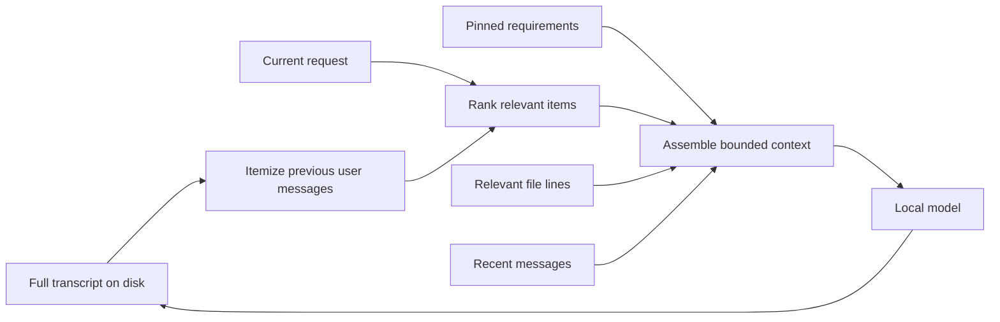

# How Ghost works

Ghost is an original local application. Its interface follows the familiar layout of a task sidebar, a conversation area, and a file panel. The AI runs through Ollama on this computer. The Semantic Integrity framework can be appended to the model's instructions.

## Source map

| File | Responsibility |
| --- | --- |
| `studio/server.mjs` | Loopback HTTP API, conversation storage, experiment runs, and model scheduling |
| `studio/core.mjs` | File boundaries, save-conflict checks, backups, and streamed Ollama responses |
| `studio/memory.mjs` | Itemization, context selection, file excerpts, and input/output budgets |
| `studio/public/app.js` | Conversations, editor, model controls, memory panel, and comparison UI |
| `studio/public/index.html` | Application layout |
| `studio/public/styles.css`, `ghost.css` | Main visual design and Ghost branding |
| `ai-bias-and-creation/prompts/priority_loader_prompt.md` | Editable reasoning framework |
| `scripts/Start-Ghost.ps1` | Launches the local application and model engine |
| `scripts/Setup-LocalModel.ps1` | Downloads the official portable engine and the selected model |

## Context cycle

1. **Retain:** every completed conversation turn stays in the session JSON file.
2. **Itemize:** split older user messages into short records with source-turn IDs. Mark explicit requirement language as constraints.
3. **Set a budget:** reserve output space before packing input. Eco uses a 4K context, Balanced 8K, and Deep 12K.
4. **Keep essentials:** include the latest request unchanged. Add pinned notes that fit and report any omitted notes.
5. **Recall:** rank older records using query-term overlap, requirement language, and recency. Deduplicate repeated records.
6. **Select file context:** attach relevant lines with their line numbers, plus a small opening excerpt. Report when only excerpts fit.
7. **Recontextualize:** combine the selected records and recent conversation, with an explicit reminder that the newest request takes precedence.
8. **Inspect:** show input estimates and recalled records in the Memory view. Store model-reported token counts and generation timings with the response.

This process uses extractive text selection, not an extra model call. It avoids introducing an unverified generated summary into the history. It is lexical retrieval: paraphrases and implicit requirements can be missed. Pin critical facts and review recalled context. The full transcript remains available even when a turn falls outside the active context.

Token estimates use UTF-8 byte length with a conservative margin. They are estimates, not an exact model tokenizer. Very large requests fail explicitly rather than silently losing the current request. No finite context window can guarantee that every older detail is available in every answer.

## Hardware strategy

- Default model: `qwen3:4b-instruct`, a quantized instruction model of about 2.5 GB.
- One active generation at a time; comparison arms run sequentially.
- Streaming output, bounded output length, and a small processing batch.
- Warm-model retention of 3 minutes for Eco and 10 minutes for larger profiles.
- Launcher enables Flash Attention and Q8 attention-cache quantization in Ollama. These settings reduce cache memory requirements when supported by the model/runtime. See [Ollama's documentation](https://docs.ollama.com/faq).
- Eco is available when other applications are competing for graphics memory. Deep can spill more work onto system RAM and run slower.

These choices aim to reduce overhead. They do not expand the model's trained capability or remove hardware limits.

## Data and edits

Ghost binds to `127.0.0.1:4317`. Its model server binds to `127.0.0.1:11435`. No cloud model endpoint is configured.

Conversations, experiments, workspace files, and previous file versions live in `.ghost/`. Model files live in `.runtime/`. Both are excluded from Git and source ZIPs.

The editor reads only configured project roots. It rejects paths outside those roots, hidden paths, and unsupported file types. Saves require the hash of the version originally opened and create a backup before writing. Chat suggestions enter the editor for review; the Save button writes them to disk. The assistant has no command-execution tool.

The original downloaded Anthropic archive is an optional local reference. Ghost's distributable application has no import from or dependency on it. Its ownership and provenance are separate from Ghost's original code.
