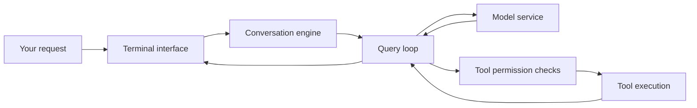

# A short tour of the recovered source

## The basic idea

Claude Code is an application around an AI model. The application collects input, builds the instructions, calls the model, handles tool requests, and displays the answer. The downloaded files implement that application; they do not contain the trained model.

## Read in this order

All paths below are relative to `claude-code-2.1.88/src/`.

| File | What to look for |
| --- | --- |
| `QueryEngine.ts` | `QueryEngine` at line 184; builds the conversation and combines system instructions around lines 321–325 |
| `query.ts` | `query` at line 219 and `queryLoop` at line 241; handles the model/tool cycle |
| `query/deps.ts` | `callModel` at line 23; the model-call function can be supplied through the dependency object |
| `services/api/claude.ts` | `queryModelWithStreaming` at line 752; model-service requests and response streaming |
| `Tool.ts` | Common tool definitions and execution context |
| `services/tools/toolOrchestration.ts` | `runTools` at line 19; schedules tool execution and passes the permission callback |
| `screens/REPL.tsx` | Main interactive terminal conversation screen |
| `main.tsx` | Command-line setup; reads `--append-system-prompt-file` around lines 1364–1372 |

Line numbers refer to the downloaded baseline and can change after editing.

## Where your framework fits

The first integration point is `appendSystemPrompt` in `QueryEngine.ts`. The engine includes this text after its existing system instructions. Your `prompts/priority_loader_prompt.md` can supply the extra reasoning rubric.

The comparison packet maps this explicitly:

- **Baseline:** same model, same request, same output headings, no framework supplement.
- **Framework:** same setup, plus the exact priority-loader prompt.

The two requests must start in separate fresh sessions. Expected answers and failure criteria belong to the reviewer and are kept in a separate file.

The current official Claude Code CLI also documents [`--append-system-prompt-file`](https://code.claude.com/docs/en/cli-reference). That offers a practical future test route using an installed, authenticated CLI. Results from that route would test the installed version and selected model, not prove that this recovered 2.1.88 snapshot runs.

## Other useful editing areas

| Change | Starting point |
| --- | --- |
| Reasoning instructions | Your framework's `prompts/priority_loader_prompt.md`, then the append path above |
| Terminal appearance | `screens/REPL.tsx`, `components/`, `ink/` |
| Slash commands | `commands.ts`, `commands/` |
| Tool behavior | `tools/`, `services/tools/` |
| Model selection | `utils/model/`, `services/api/` |
| Memory and long conversations | `memdir/`, `services/compact/` |

Changing a model name alone will not make an arbitrary local model work. The API adapter expects particular message, streaming, and tool-call formats. `query/deps.ts` is a useful seam to study, but importing it also imports other application modules.

## Build limitations verified locally

- The extract has no project `package.json`, lockfile, or TypeScript build configuration.
- `src/types/message.js` is imported by central modules, but no matching message source file is present under `src/types/`.
- Core modules import `bun:bundle` and use build-time feature switches.
- The snapshot includes 1,332 `.ts`, 552 `.tsx`, and 18 `.js` files; there is no installer or model-weight file in this downloaded ZIP.

These are concrete reasons the extract cannot be treated as a ready-to-run development checkout. Further reconstruction would need dependency versions, missing modules, and build configuration.

